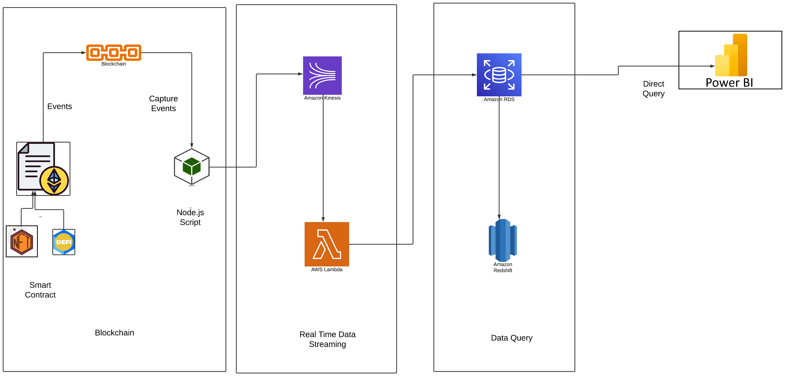

# Real-Time NFT and DeFi Data Analysis Platform

## Overview

This project demonstrates a comprehensive architecture for capturing, processing, and analyzing NFT and DeFi transaction data in real time. Leveraging blockchain technology, AWS services, and advanced data engineering practices, the platform provides actionable insights for customers and businesses. Here's a detailed breakdown of how the system works:

## Table of Contents

- [Architecture Overview](#architecture-overview)
- [Components](#components)
  - [Smart Contracts](#smart-contracts)
  - [Node.js Event Capture](#nodejs-event-capture)
  - [Amazon Kinesis](#amazon-kinesis)
  - [AWS Lambda](#aws-lambda)
  - [Amazon RDS](#amazon-rds)
  - [Amazon Redshift](#amazon-redshift)
  - [Power BI](#power-bi)
- [Setup Instructions](#setup-instructions)
  - [Prerequisites](#prerequisites)
  - [Step-by-Step Setup](#step-by-step-setup)
- [Conclusion](#conclusion)
- [References](#references)

## Architecture Overview

1. **Smart Contract Events**: Blockchain transactions such as creating, buying, or selling NFTs, or performing DeFi operations like swapping and lending, emit events containing transaction details.
2. **Node.js Event Capture**: A Node.js application captures these emitted events in real time.
3. **Amazon Kinesis**: The captured events are sent to Amazon Kinesis for real-time data streaming.
4. **AWS Lambda Processing**: Kinesis triggers AWS Lambda functions, which process the events based on the transaction type (e.g., updating NFT creation tables or transaction tables).
5. **Data Storage**: Processed data is stored in Amazon RDS in a structured, tabular format.
6. **Zero ETL Configuration**: A zero ETL configuration is set up from RDS to Amazon Redshift for seamless data transfer and SQL query execution.
7. **Real-Time Insights**: Real-time data visualization is achieved by connecting RDS directly to Power BI using Direct Query, providing up-to-the-minute insights.

## Components

### Smart Contracts

Smart contracts are deployed on the blockchain to handle NFT and DeFi transactions. These contracts emit events with transaction details, such as NFT creation, buying/selling, swapping, and lending.

### Node.js Event Capture

A Node.js application listens for events emitted by the smart contracts and captures these events in real time.

### Amazon Kinesis

Captured events are sent to Amazon Kinesis, which streams the data for further processing.

### AWS Lambda

AWS Lambda functions are triggered by Kinesis streams to process the events. Based on the transaction type, Lambda functions update the relevant tables in Amazon RDS.

### Amazon RDS

Amazon RDS stores the processed data in a structured, tabular format. This includes tables for NFT creation, NFT transactions, and other DeFi operations.

### Amazon Redshift

A zero ETL configuration is set up to transfer data from RDS to Amazon Redshift, allowing for complex SQL queries and data analysis.

### Power BI

Power BI is connected to Amazon RDS using Direct Query to provide real-time data visualization and insights.

## Setup Instructions

### Prerequisites

- AWS account with necessary permissions
- Node.js installed
- AWS CLI configured
- Power BI account

### Step-by-Step Setup

1. **Deploy Smart Contracts**: Deploy the smart contracts on the blockchain.
2. **Set Up Node.js Application**: Set up the Node.js application to listen for smart contract events.
3. **Configure Amazon Kinesis**: Create Kinesis streams to capture the events from the Node.js application.
4. **Set Up AWS Lambda Functions**: Create Lambda functions to process the events from Kinesis streams.
5. **Configure Amazon RDS**: Set up RDS instances and create necessary tables for storing processed data.
6. **Set Up Zero ETL Configuration**: Configure zero ETL from RDS to Redshift.
7. **Connect Power BI**: Connect Power BI to RDS using Direct Query for real-time insights.

## Conclusion

This architecture provides a scalable and efficient solution for real-time analysis of NFT and DeFi transactions. By leveraging AWS services and modern data engineering practices, businesses can gain actionable insights to make informed decisions.

## References

- [AWS Kinesis Documentation](https://aws.amazon.com/kinesis/)
- [AWS Lambda Documentation](https://aws.amazon.com/lambda/)
- [Amazon RDS Documentation](https://aws.amazon.com/rds/)
- [Amazon Redshift Documentation](https://aws.amazon.com/redshift/)
- [Power BI Documentation](https://powerbi.microsoft.com/documentation/)
